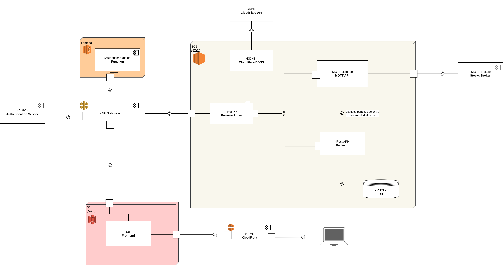

# Entrega 1 - IIC2173 - Grupo 19
## Fintech Async
### 2023-2

---

## Dominio, enlaces y documentación

- [API y backend: api.arqui.ljg.cl/stocks](https://api.arqui.ljg.cl/stocks)
- [MQTT listener: mqtt.arqui.ljg.cl](https://mqtt.arqui.ljg.cl)
- [Documentación con Postman](https://documenter.getpostman.com/view/20894725/2s9YC7RqfQ#16a7b195-e005-470d-a011-c92a5c9822fe)
 La documentación de la API Gateway se encuentra en [el json anexo](./ArquisisE1-ApiGatewayV2-oas30-postman.json)
- [API Gateway](gateway.ljg.cl/v1) con dominio personalizado

## Características implementadas y no implementadas

#### Requisitos funcionales (15 pts)
- [ ] RF01 (Esencial): 
 Sus usuarios deben poder **registrarse en la plataforma con datos de contacto y un correo electrónico**, 
 además de poder ingresar dinero a una billetera virtual
personal.
- [X] RF02: 
 Los usuarios deben poder ver una lista de las empresas disponibles en el servidor por orden de llegada.
- [X] RF03 (2 ptos) (Esencial): 
 Debe poder verse el detalle histórico de cada empresa de **forma paginada** y dar la opción de compra.
- [X] RF04 (2 ptos): 
 Deben obtener la ubicación desde donde el usuario hizo la compra desde su dirección IP. 
 Para esto pueden usar ChatGPT para apoyarse.
  - [ ] Bonus de 2 décimas si muestran un gráfico con los datos históricos de la última semana indicando la variación 
   de precios por hora
- [X] RF06 (2 ptos) (Esencial): 
 Al comprar una entrada se deberá enviar la solicitud por el canal `stocks/requests` y esperar la respuesta de si 
 es válida por el canal `stocks/validation`.
- [X] RF07 (3 ptos) (Esencial): 
 Deberán estar escuchando los canales de `stocks/requests` y `stocks/validation` continuamente para ir actualizando su
 cantidad de _(¿)entradas(?)_ disponibles.

#### Requisitos no funcionales (39 pts)
- [X] RNF01 (6 ptos) (Esencial): 
 Deben usar un formato de Backend-Frontend separado: una API con respuestas JSON y un frontend.
 Esto es muy importante puesto que es crítico para las siguientes entregas. 
 El Frontend debe ser ojalá una SPA con un Framework que permita exportar el build de su frontend, como React o Vue.
- [X] RNF02 (2 ptos) (Esencial): 
 Sus aplicaciones en backend deben estar cada una en un contenedor Docker distinto.
 Debe coordinarse el levantamiento mediante docker compose.
- [X] RNF03 (2 ptos) (Esencial):
 Deben tener configuradas Budget alerts en la cuenta que ocupen como grupo, para no alejarse del Free tier de AWS y que
 se den cuenta si les cobran para que cierren esos servicios.
- [ ] RNF04 (6 ptos) (Esencial): 
 Su API debe estar detrás de una AWS API gateway tipo REST o HTTP, con los endpoints declarados en esta.
 **Debe asociarse un subdominio a esta (e.g. api.miapp.com) y debe tener CORS correctamente configurado.**
- [X] RNF05 (3 ptos) (Esencial): Su app debe ofrecer su backend y frontend utilizando HTTPS.
- [X] RNF06 (6 ptos) (Esencial): 
 Deben implementar un servicio de autenticacion/autorización (auth). 
 Este servicio puede ser en base a un servicio de terceros como Auth0 (recomendado), cognito o pueden hacerlo ustedes. 
 Este RNF requiere que ustedes extraigan toda la lógica de los usuarios de la app principal y la trasladen al servicio
 hecho por ustedes o el externo. Recomendamos fuertemente usar el modelo Oauth o como mínimo intercambiar tokens JWT con
 la audiencia e issuer correctos.
  - [ ] Si hacen un servicio ustedes desde 0, tienen un bonus de 5 ptos, esto implica gestión de tokens JWT con OAuth2,
   gestión de la información de usuarios, una gestión segura de los tokens a nivel de frontend, 
   y debe correr como un contenedor/servicio aparte.
- [X] RNF07 (3 ptos): 
 Su frontend debe estar desplegado en S3 con una distribución Cloudfront.
- [X] RNF08 (3 ptos): 
 Su API Gateway debe poder usar al servicio del RNF05 para autenticar a los usuarios directamente, 
 es decir que antes de enviar la request a su API, API Gateway verifica que el token sea correcto. 
 Dentro de API Gateway deben crearle un Custom Authorizer su usan tipo REST para poder autenticar sus requests previos a
 mandarlos a su API.
- [X] RNF09 (8 ptos): 
 Deben implementar un pipeline de CI. Como proveedores aceptados están CircleCI, Github Actions y AWS codebuild. 
 Recomendamos los dos primeros porque los ayudantes tienen experiencia en estos dos. Esta implementación debe correr un 
 linter que revise su código.
  - [X] Implementar un build simple que resuelva un test trivial que pueda fallar solo para el backend 
   (tipo assert false o similar) tiene un bonus de 3 ptos.
  - [ ] Implementar un pipeline CI para su frontend que revise con un linter su aplicación y haga uso de revisiones de
   performance de lighthouse tiene bonus de 3 ptos.

#### Documentación (6 ptos)
- [X] RDOC01 (3 ptos): 
 Deben crear un diagrama UML de componentes de la entrega, con explicaciones y detalle sobre el sistema. Esto deben 
 tenerlo para la fecha final de entrega.
- [X] RDOC02 (2 ptos): 
 Deben documentar los pasos necesarios para replicar el pipe CI que usaron en su aplicación (Qué pasos sigue si CI).
- [X] RDOC03 (1 ptos): 
 Deben dejar una documentación de alguna forma de correr su aplicación en un ambiente local para propósitos de testeo 
 (que instalar, que poner en el .env, como correr la app, etc).


## Acceso al servidor

El acceso es mediante ssh al puerto `22` y host `arqui.ljg.cl`.
El usuario es `ubuntu`.
No tiene contraseña de acceso, pero se necesita un archivo `.pem` para acceder.

## Cómo correr la aplicación en un ambiente local:

<em>
 Existen dependencias en nginx que pueden afectar el funcionamiento del código.
</em>

### 1. Dependencias
Se necesita tener instalado docker engine.

### 2. Deploy en modo producción (para Linux, WSL & Mac OS)
1- Crear archivo con variables de entorno a partir del template:
```bash
cp template.env .env
```

2- Completar las credenciales y secretos en el `.env`
```dotenv
     ...
17 | IP_INFO_TOKEN=<COMPLETAR>
     ...
29 | DB_USERNAME=<COMPLETAR>
30 | DB_PASSWORD=<COMPLETAR>
     ...
48 | MQTT_BROKER_USERNAME=<COMPLETAR>
49 | MQTT_BROKER_PASSWORD=<COMPLETAR>
     ...
57 | CLOUDFLARE_API_KEY=<COMPLETAR>
   |
```

3- Levantar el proyecto en modo producción

Correr el siguiente script:
```bash
./deploy.production.unix.sh
```

Tiene las instrucciones de:
- construir las imágenes de docker que se hacen a partir de nuestro código.
- Descargar las imágenes de docker faltantes que usamos para el proyecto
- Crear los contenedores de docker
- Levantar los contenedores de docker en segundo plano (_daemonized_)

El backend debería estar disponible en `http://localhost:${API_PORT}/stocks`

## Integración continua

Se hizo uso de GitHub Actions para implementar un proceso de CI.
El flujo de trabajo se define en un archivo YAML ubicado en la carpeta `.github/workflows` del repositorio y se ejecuta
con cada push a las ramas `main`, `development`, `fix/*` y `feat/*`.

1. Actualiza el repositorio en github
2. Settea las variables de entorno
3. Crea un ambiente de trabajo de node
4. Instala las dependencias del proyecto
5. Realiza las migraciones en la base de datos e integra los datos de las seeds
6. Ejecuta los tests básicos
7. Corre un lint

## Diagrama UML de despliegue

Se encuentra en un archivo .xml que se puede abrir con cualquier editor que use el mismo estádar de diagrams.net
o con drawio.




##### Explicaión del flujo:
- El cliente se conecta al CDN de Amazon (Cloudfront)
- Cloudfront extrae el frontend del bucket (S3) y se lo pasa al cliente.
- Mediante dicho frontend el cliente envía requests al gateway de Amazon (API Gateway). 
 La primera request que se envía es el login.
- El gateway redirige al usuario al sitio de auth0, el que devolverá la información de la cuenta Google 
 del usuario y el token asociado. De ahora en adelante todas las acciones que realice el usuario serán checkeadas 
 en la API Gateway con dicho token.
- Aquellas acciones del usuario que requieran acceso al backend del programa pasaran mediante la API Gateway a la
 instancia de EC2, donde se encuentra el backend y el mqtt listener.
- El backend tiene conexión directa a la base de datos y guarda todos los eventos, junto con manejar las requests GET y
 POST con información sobre usuario, acciones, compras y validaciones
- El backend se encuentra conectado también al listener MQTT, que intercambia información con el broker MQTT. Actúa como
 una capa de middleware entre la API REST y el Broker MQTT.
- Anexo a lo anterior, pero todavía dentro de la instancia de EC2 se encuentra un contenedor que actualiza el registro A
 del DNS, asegurándose que si cambia la IP del servidor el DNS apunte a la nueva IP.
